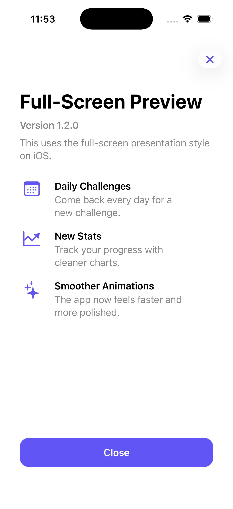
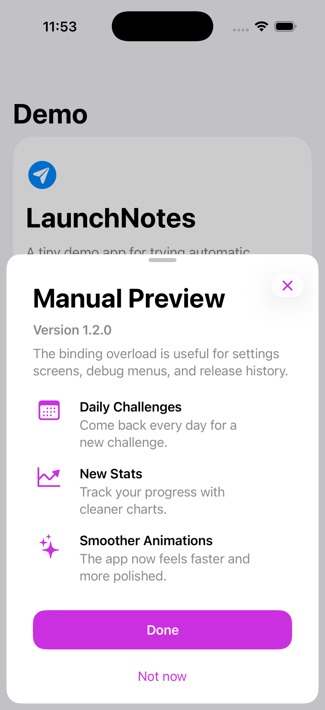

# LaunchNotes

[](https://swift.org)
[](Package.swift)
[](LICENSE)

LaunchNotes is a small SwiftUI package for presenting native-feeling "What's New" screens in iOS and macOS apps.

It is built for apps that want release notes to be easy to add, easy to customize, and hard to forget. The default API uses the app bundle version automatically, stores the last seen version in `UserDefaults`, and presents only when the current version has not been seen.

## Preview

| Full-screen presentation | Manual sheet presentation |
| --- | --- |
|  |  |

## Why

Most apps need a simple way to tell users what changed after an update. LaunchNotes keeps that workflow close to SwiftUI:

- Define notes directly where you attach the modifier.
- Use the app version automatically or pass an explicit version.
- Keep multiple release definitions in one place.
- Present automatically, manually, as a sheet, or full-screen.
- Customize tint, layout, icon behavior, actions, and footer links without building a custom screen.

## Requirements

- Swift 6.3
- iOS 26 or later
- macOS 26 or later

## Installation

Add the package in Xcode:

```text
File > Add Package Dependencies...
```

Use this repository URL:

```text
https://github.com/pol-cova/LaunchNotes
```

Then import it where you build your app UI:

```swift
import LaunchNotes
```

## Quick Start

Attach `launchNotes` to your root view and list the notes. This uses `Bundle.main` for the current version.

```swift
struct ContentView: View {
    var body: some View {
        HomeView()
            .launchNotes {
                LaunchNote("Daily Challenges", "Come back every day for a new challenge.", systemImage: "calendar")
                LaunchNote("New Stats", "Track your progress with cleaner charts.", systemImage: "chart.line.uptrend.xyaxis")
                LaunchNote("Smoother Animations", "The app now feels faster and more polished.", systemImage: "sparkles")
            }
    }
}
```

LaunchNotes stores the last seen version under `LaunchNotes.lastSeenVersion` in `UserDefaults.standard`. When the resolved version changes, the notes present automatically.

## Basic Customization

```swift
HomeView()
    .launchNotes(
        title: "Fresh Updates",
        subtitle: "Here's what changed in this version.",
        buttonTitle: "Looks good",
        animation: .bouncy,
        presentation: .sheet,
        style: .compact
    ) {
        LaunchNote("Daily Challenges", "Come back every day for a new challenge.", systemImage: "calendar")
        LaunchNote("New Stats", "Track your progress with cleaner charts.", systemImage: "chart.line.uptrend.xyaxis")
    }
```

If you want to control the version yourself, pass `version:`.

```swift
HomeView()
    .launchNotes(version: "1.2.0") {
        LaunchNote("New Stats", "Cleaner progress charts.", systemImage: "chart.line.uptrend.xyaxis")
    }
```

## Multiple Releases

Use `LaunchNotesRelease` when you want to keep a release history in one place. Put the newest release first. In automatic mode, LaunchNotes presents the first release only when its version has not been seen.

```swift
HomeView()
    .launchNotes(onFooterAction: showPrivacyInfo) {
        LaunchNotesRelease(
            "1.2.0",
            title: "What's New in 1.2",
            subtitle: "A cleaner update for daily use.",
            buttonTitle: "Continue",
            accentColor: .blue,
            footerTitle: "About Privacy"
        ) {
            LaunchNote("Daily Challenges", "Come back every day for a new challenge.", systemImage: "calendar")
            LaunchNote("New Stats", "Track your progress with cleaner charts.", systemImage: "chart.line.uptrend.xyaxis")
        }

        LaunchNotesRelease("1.1.0") {
            LaunchNote("Search", "Find previous sessions faster.", systemImage: "magnifyingglass")
        }
    }
```

## Manual Presentation

Use the binding overload for settings screens, debug menus, onboarding flows, or release history buttons.

```swift
struct SettingsView: View {
    @State private var showReleaseNotes = false

    private let release = LaunchNotesRelease("1.2.0", title: "Release Notes") {
        LaunchNote("Daily Challenges", "Come back every day for a new challenge.", systemImage: "calendar")
        LaunchNote("New Stats", "Track your progress with cleaner charts.", systemImage: "chart.line.uptrend.xyaxis")
    }

    var body: some View {
        Button("Show Release Notes") {
            showReleaseNotes = true
        }
        .launchNotes(isPresented: $showReleaseNotes, release: release)
    }
}
```

## Styling

Use `LaunchNotesStyle` to customize the default appearance.

```swift
HomeView()
    .launchNotes(
        presentation: .fullScreen,
        style: .prominent
    ) {
        LaunchNote("New Stats", "Cleaner progress charts.", systemImage: "chart.line.uptrend.xyaxis")
    }
```

Built-in presets:

- `.default`: clean baseline styling.
- `.compact`: smaller radius and simple presentation.
- `.prominent`: shows the header icon and uses a stronger presentation.
- `.minimal`: simple, quiet styling.

Custom style:

```swift
LaunchNotesStyle(
    accentColor: .indigo,
    cornerRadius: 18,
    iconStyle: .circle,
    showsHeaderIcon: false,
    buttonLayout: .vertical
)
```

You can also set a style higher in the view hierarchy:

```swift
HomeView()
    .launchNotes(version: "1.2.0", notes: notes)
    .launchNotesStyle(.init(accentColor: .green))
```

Release-level tint overrides the style tint:

```swift
LaunchNotesRelease("1.2.0", accentColor: .teal) {
    LaunchNote("Privacy", "Updated privacy controls.", systemImage: "lock")
}
```

## Footer Actions

A release can include a footer link, such as "About Privacy". Provide `footerTitle` on the release and `onFooterAction` on the modifier.

```swift
HomeView()
    .launchNotes(onFooterAction: showPrivacyDetails) {
        LaunchNotesRelease("1.2.0", footerTitle: "About Privacy") {
            LaunchNote("New Stats", "Cleaner progress charts.", systemImage: "chart.line.uptrend.xyaxis")
        }
    }
```

## API Overview

### LaunchNote

```swift
LaunchNote(
    "Title",
    "Description",
    systemImage: "sparkles"
)
```

### LaunchNotesRelease

```swift
LaunchNotesRelease(
    "1.2.0",
    title: "What's New",
    subtitle: "Here's what changed.",
    buttonTitle: "Continue",
    secondaryButtonTitle: nil,
    headerSystemImage: "sparkles",
    accentColor: .blue,
    footerTitle: "About Privacy"
) {
    LaunchNote("New Stats", "Cleaner progress charts.", systemImage: "chart.line.uptrend.xyaxis")
}
```

Omit the version to use the current bundle version:

```swift
LaunchNotesRelease(title: "Fresh Updates") {
    LaunchNote("New Stats", "Cleaner progress charts.", systemImage: "chart.line.uptrend.xyaxis")
}
```

### Presentation

```swift
.launchNotes(
    mode: .automatic,
    animation: .smooth,
    presentation: .sheet
) {
    LaunchNote("New Stats", "Cleaner progress charts.", systemImage: "chart.line.uptrend.xyaxis")
}
```

Modes:

- `.automatic`: present when the current version has not been seen.
- `.always`: present every time the host view appears.
- `.manual`: never auto-present. Use a binding overload.

Presentations:

- `.sheet`: presents as a sheet.
- `.fullScreen`: uses `fullScreenCover` on iOS. On macOS, it falls back to a sheet.

Animations:

- `.smooth`
- `.bouncy`
- `.fade`
- `.slide`
- `.none`

### Version Helpers

```swift
let version = LaunchNotesVersion.current()
```

Resolution order:

1. `CFBundleShortVersionString`
2. `CFBundleVersion`
3. `"1.0"`

## Storage and Testing

By default, LaunchNotes stores the seen version using:

```swift
LaunchNotesDefaultStorageKey // "LaunchNotes.lastSeenVersion"
```

Use a custom store in tests, previews, or debug environments:

```swift
HomeView()
    .launchNotes(
        version: "1.2.0",
        notes: notes,
        userDefaults: UserDefaults(suiteName: "PreviewDefaults")!,
        storageKey: "preview.lastSeenLaunchNotesVersion"
    )
```

Reset during development:

```swift
UserDefaults.standard.removeObject(forKey: LaunchNotesDefaultStorageKey)
```

## Demo

The package includes an iOS demo app in `Examples/LaunchNotesDemo`.

```bash
open LaunchNotes.xcworkspace
```

Use the `LaunchNotesDemo` scheme to run the demo app.

## Contributing

See [CONTRIBUTING.md](CONTRIBUTING.md).

## License

LaunchNotes is available under the MIT license. See [LICENSE](LICENSE).
